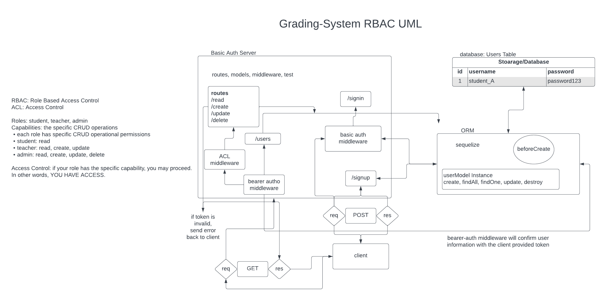

# Gradebook Application

## Author: Tricia and Kao

## Problem Domain

Our project aims to create a secure server that facilitates user sign-in and sign-up functionality, focusing on providing users, especially teachers, access to grade information through CRUD (Create, Read, Update, Delete) operations. Building upon the foundation of our previous lab (Lab 8 - Auth API), we have integrated additional features for managing grades.

## Links and Resources

- Code from previous lab, lab 8 (auth api).
- Received guidance and assistance from Ryan in implementing CRUD operations related to grades.

## Setup

### Environment Variables

PORT - Port Number
DATABASE_URL - URL to the running PostgreSQL instance/database
SECRET - Secret for JWT tokens

### Initializing and Running the Application

To set up and run the application, follow these steps:

1. Create a repository for the project.
3. Run `npm install` to install the necessary dependencies.
4. Configure the database by running `npm run db:config` and edit the generated configuration file as needed.
5. Create the database by executing `npm run db:create`.
6. Start the application using `npm start`.

### Features / Routes

Our application offers the following routes and features, some of which require basic or bearer authentication:

- GET: /api/v2/food - Retrieve all food records.
- GET: /api/v2/food/:id - Retrieve a specific food record.
- POST: /api/v2/food - Create a new food record.
- PUT: /api/v2/food/:id - Update a food record by its ID.
- PATCH: /api/v2/food/:id - Partially update a food record by its ID.
- DELETE: /api/v2/delete - Delete a food record.

### UML Diagra,

This UML diagram provides an overview of the project's architecture and relationships, illustrating the CRUD functionality for managing grade records.
